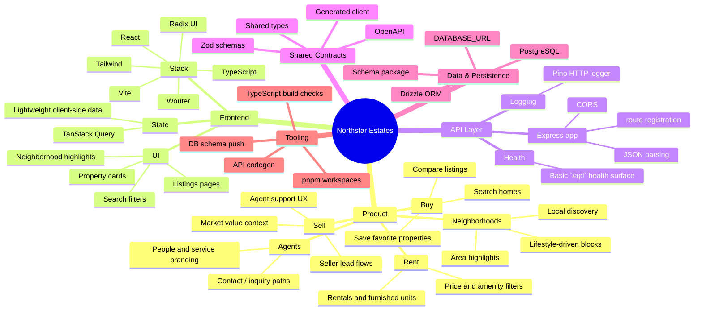
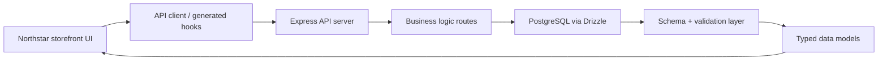

# Brainmap: Northstar Estates

Northstar Estates is a real-estate marketplace project that combines a polished property-search frontend with a typed API/data layer for a future full-stack property platform.

## Repository map

- `artifacts/northstar-estates/` — primary customer-facing web app
  - React + Vite + TypeScript
  - Wouter routing, Tailwind styling, Radix UI primitives
  - Property listings, neighborhood pages, discovery flows, and lead-oriented UI
- `artifacts/api-server/` — backend service
  - Express app with JSON parsing and CORS
  - Logger and route registration
  - Exposes `/api` endpoints for business logic and future services
- `lib/db/` — database schema layer
  - Drizzle ORM + Postgres schema source of truth
  - Shared typing and validation helpers
- `lib/api-spec/` — API contract source
  - OpenAPI generation pipeline
  - `orval` used to regenerate client bindings
- `lib/api-client-react/` — generated frontend client
  - Typed API hooks and request helpers
- `lib/api-zod/` — generated Zod validation models
- `artifacts/mockup-sandbox/` — experimental UI/mockup workspace
  - Visual prototype and design system exploration
- `scripts/` — repo scripts/helpers

## Product brainmap

## Architecture flow

## Key implementation patterns

- Monorepo-first structure: front-end, API, shared libs, and schema work are intentionally separated to keep interfaces explicit.
- Generated API contracts: the project expects an OpenAPI source of truth with generated React client code and Zod types.
- Strong TypeScript pipeline: `pnpm run typecheck` and `pnpm run build` verify the workspace before deployment.
- Feature-oriented product UX: “buy / sell / rent / neighborhoods / agents” are the core product pillars driving the app surface.

## Recommended mental model

Think of the project as three connected layers:

1. Product experience layer — the polished real-estate front-end in `artifacts/northstar-estates`
2. Service layer — the API server in `artifacts/api-server`
3. Data contract layer — the database schema, OpenAPI definitions, and generated clients in `lib/*`

This structure keeps the app easy to extend as property data, search features, and agent workflows grow.
