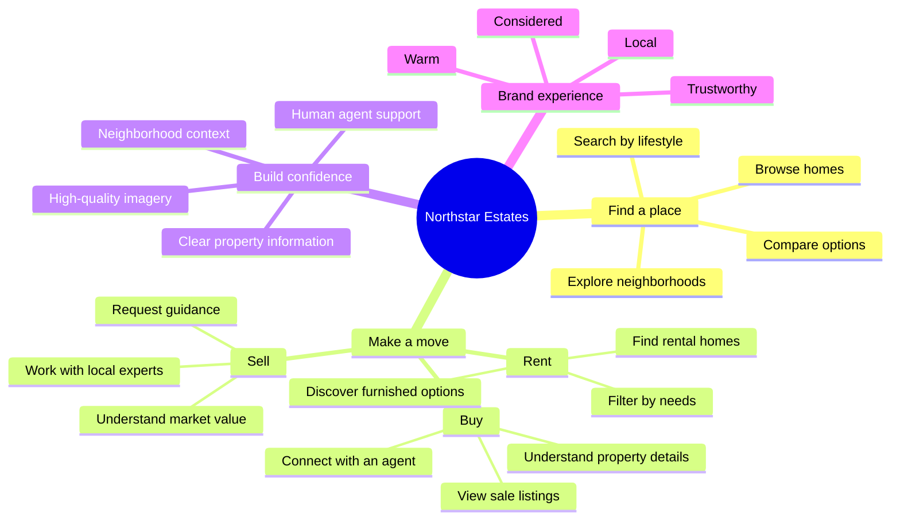
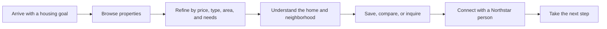

# Northstar Estates: Stakeholder Brainmap

Northstar Estates helps people discover, evaluate, and act on real-estate opportunities through a calm, editorial property experience.

## Product at a glance

## Customer journey

## Primary audiences

- **Buyers** — want confidence that a home fits their lifestyle and budget.
- **Renters** — want a fast path to suitable, well-presented homes.
- **Sellers** — want informed guidance and a trusted local partner.
- **Neighborhood explorers** — are choosing an area before choosing a property.
- **Agents and advisors** — need a polished digital storefront for their expertise.

## Experience pillars

| Pillar | What it means |
| --- | --- |
| Discovery | Make browsing feel inspiring rather than transactional. |
| Clarity | Present essential property facts in an easy-to-scan format. |
| Context | Pair homes with neighborhood character and local perspective. |
| Trust | Make it simple to reach a real person when the customer is ready. |
| Momentum | Every page should lead naturally to a useful next action. |

## Success looks like

- More qualified property inquiries.
- More meaningful engagement with neighborhoods and listings.
- A clear path from inspiration to agent contact.
- A consistent Northstar experience across buying, renting, and selling.

See [BRAINMAP.md](./BRAINMAP.md) for the engineering-oriented repository and architecture map.
